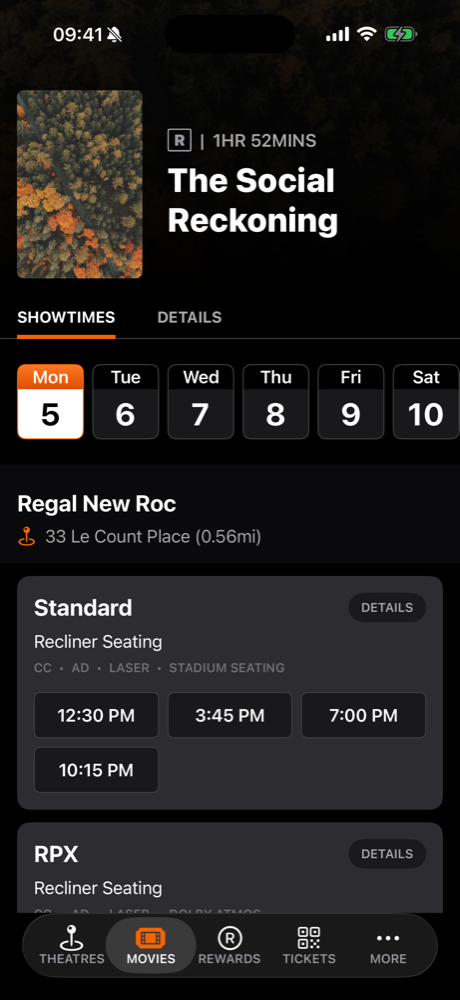
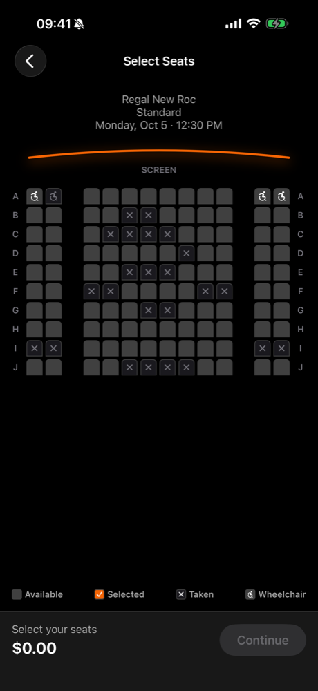
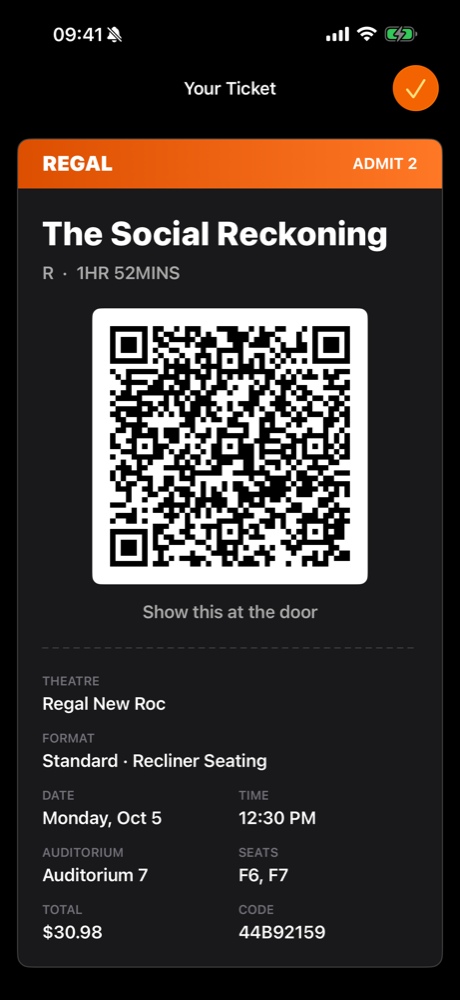
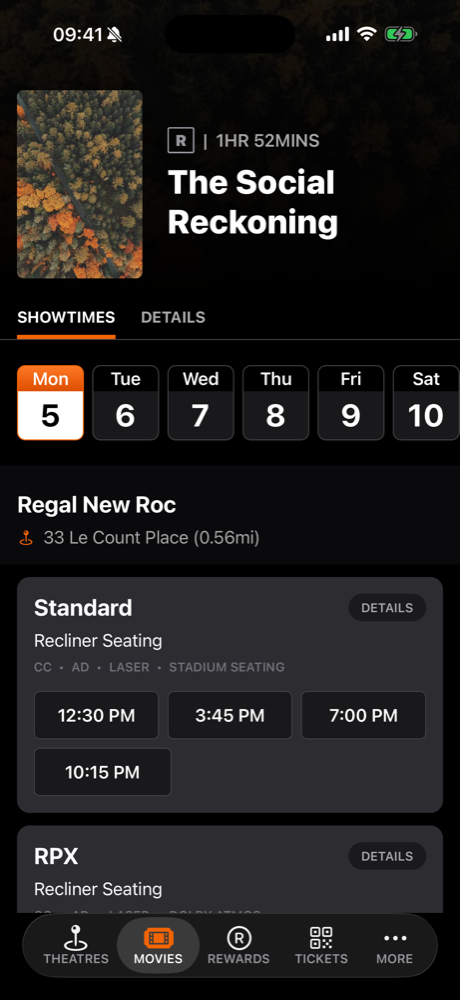
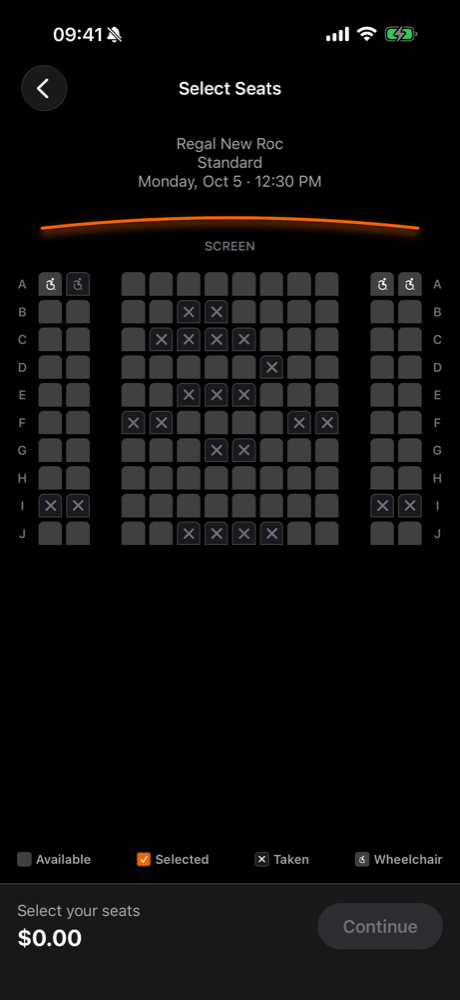
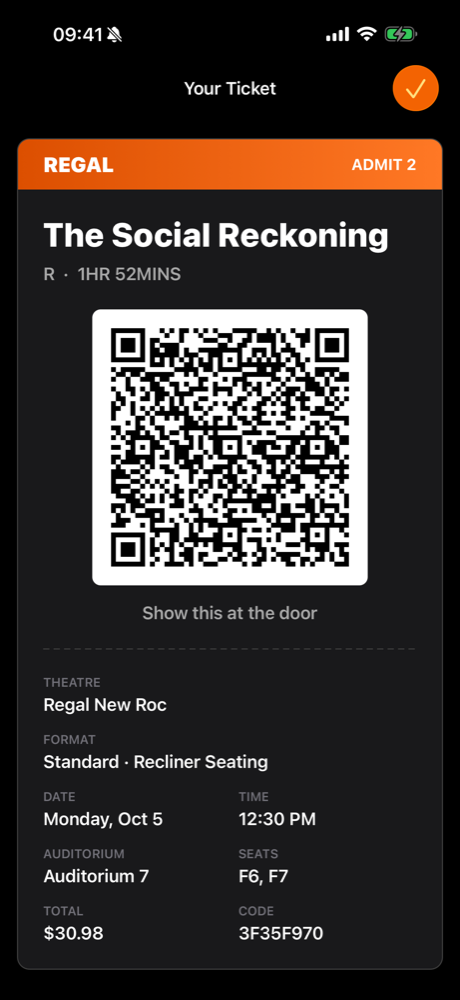

# Regal Cinemas: Swift to Expo

<p align="center">
  
  &nbsp;&nbsp;&nbsp;<b>&rarr;</b>&nbsp;&nbsp;&nbsp;
  
</p>

<p align="center"><i>Small POC of a Swift app ported to React Native with Expo.</i></p>

The same "Get Tickets" feature built twice: once in **Swift / UIKit**, once in **React Native + Expo**.
The Expo app uses Expo libraries first and keeps native code only where the platform owns the capability. That native code is the UIKit app's own `CaptureObserver`, shared as the same Swift file.

- `regal-swift/`: UIKit, Swift 6 (strict concurrency), MVVM + Coordinator, XcodeGen.
- `regal-expo/`: Expo SDK 58, New Architecture, expo-router, TypeScript strict, one local Expo Module (`ticket-kit`).

<table>
  <tr><th></th><th>Movie detail</th><th>Seat selection</th><th>Ticket</th></tr>
  <tr>
    <th>Swift</th>
    <td></td>
    <td></td>
    <td></td>
  </tr>
  <tr>
    <th>Expo</th>
    <td></td>
    <td></td>
    <td></td>
  </tr>
</table>

## Where to look first

1. [`ticket-kit/ios/TicketKitModule.swift`](regal-expo/modules/ticket-kit/ios/TicketKitModule.swift): the whole native surface of the Expo app. Main-queue reads, listener-scoped observation, no retain cycles.
2. [`TicketKitCore/CaptureObserver.swift`](regal-swift/TicketKitCore/CaptureObserver.swift): the Swift file both apps compile. The module links it through a symlink instead of rewriting it.
3. [`useTicketScreenProtection.ts`](regal-expo/src/features/ticket/useTicketScreenProtection.ts): the `viewWillAppear` / `viewWillDisappear` + `NotificationCenter` lifecycle, ported to focus effects and `AppState`.
4. [`domain/seatSelection.ts`](regal-expo/src/domain/seatSelection.ts): business rules as pure functions, with [tests](regal-expo/src/features/seatSelection/seatSelection.test.tsx) named after the XCTests.
5. [`SeatCell.tsx`](regal-expo/src/features/seatSelection/components/SeatCell.tsx): one store selector per seat, so a tap re-renders one cell, not 120.
6. [`store/booking.ts`](regal-expo/src/store/booking.ts): Zustand + MMKV. Only purchased tickets persist, never the in-progress selection.

**Reading guide:** `// SWIFT:` comments in the Expo code name the UIKit construct each line replaces, so a Swift reviewer can read the port side by side.

## Built PR by PR

The Swift app is committed in one piece. The Expo app is committed as eight steps, each the size of a reviewable PR, each passing `tsc`, `expo lint` and `jest` on its own. The history was rebuilt into these steps for review, so commit dates are not development dates.

**Release** comes from [`@expo/fingerprint`](https://docs.expo.dev/versions/latest/sdk/fingerprint/) (iOS), recorded in each commit's trailers. A changed hash means the merge needs a new native build (EAS Build + store). An unchanged hash means it ships as an OTA update (EAS Update).

| #   | PR                                                                                                                             | Why                                      | Release                    | Size  | Review focus                             |
| --- | ------------------------------------------------------------------------------------------------------------------------------ | ---------------------------------------- | -------------------------- | ----- | ---------------------------------------- |
| 0   | [Swift app + TicketKitCore](https://github.com/gg-ballin/regal-swift-to-expo/commit/f303c634818759e42f25c10a0cd3d5868b2687cd)  | The reference behavior                   | App Store                  | +4303 | Baseline, not part of the port           |
| 1   | [Scaffold + native baseline](https://github.com/gg-ballin/regal-swift-to-expo/commit/34bc142beb6fe5b15bbe3cdd381945c4cec7450a) | Ship every native library in one binary  | **Native build** `97f31b2` | +330  | Conventions, routing, dependency choices |
| 2   | [Data contract](https://github.com/gg-ballin/regal-swift-to-expo/commit/130ef94ce099d47238b4eade0ce8019234dbe50e)              | Validate data at the boundary            | OTA `97f31b2`              | +247  | zod schemas, repository seam             |
| 3   | [Domain rules + store](https://github.com/gg-ballin/regal-swift-to-expo/commit/d84d516217996a4cb2e15aae52b2767e00843bc5)       | Money and seat rules as pure functions   | OTA `97f31b2`              | +706  | Rules, what persists and what doesn't    |
| 4   | [Movie detail](https://github.com/gg-ballin/regal-swift-to-expo/commit/904d2dc1cb513fb3d31e65d2d2efe6213fd45670)               | Entry screen, list pattern               | OTA `97f31b2`              | +725  | Row union, IDs-only navigation           |
| 5   | [Seat selection](https://github.com/gg-ballin/regal-swift-to-expo/commit/106c1a9fa8880d8dc900651b5da2038a13129241)             | 120 seats, instant taps                  | OTA `97f31b2`              | +592  | Per-cell selectors, haptics, a11y        |
| 6   | [Ticket (JS only)](https://github.com/gg-ballin/regal-swift-to-expo/commit/3cd1d3607a45066f03181683847285327daa942e)           | Offline QR, brightness, screenshot alert | OTA `97f31b2`              | +656  | Focus-scoped side effects                |
| 7   | [ticket-kit Expo Module](https://github.com/gg-ballin/regal-swift-to-expo/commit/b93af3db64552d51693c6583fc91e76402362ce0)     | The one gap Expo doesn't cover           | **Native build** `f7017df` | +311  | Swift boundary, lifecycle, fallback      |
| 8   | [Ticket history + demo link](https://github.com/gg-ballin/regal-swift-to-expo/commit/926b40d98afd73a9e55271e9d5240b2ab8b41224) | Tickets survive restarts                 | OTA `f7017df`              | +245  | Persistence, dev tooling                 |

**2 of 8 Expo PRs needed a native build.** PR 1 sets the native baseline. PR 7's hash changed for exactly two reasons: `modules/ticket-kit/ios` and the iOS autolinking config. Sizes exclude the lockfile and JSON fixtures.

```bash
git log --format='%h %s | %(trailers:key=Release,valueonly)'   # tags
cd regal-expo && npx @expo/fingerprint fingerprint:generate --platform ios   # reproduce a hash
```

<details>
<summary><b>1. Scaffold + native baseline</b></summary>

- Expo SDK 58, TypeScript strict, expo-router with `NativeTabs` (a real `UITabBarController`), dev client with Continuous Native Generation (no `ios/` committed).
- Every native library the v1 binary needs lands here, so the feature PRs after it stay JS-only.
- `theme.ts` ported from `Theme.swift`. [`AGENTS.md`](regal-expo/AGENTS.md) holds the rules AI coding agents follow in this repo (versioned Expo docs, `expo install` only, lint and typecheck before done).
</details>

<details>
<summary><b>2. Data contract</b></summary>

- zod schemas replace the Swift `Codable` models; types are inferred from them.
- Same `MovieRepository` interface as Swift, injected through context so tests swap in a fake.
- The bundled JSON is a copy of `regal-swift/MockData`, and a test fails if they drift.
</details>

<details>
<summary><b>3. Domain rules + store</b></summary>

- Seat toggle rules, ordering, totals in integer cents, ticket building, and a QR payload with sorted keys, so both apps encode the same string.
- No React or platform imports: testable without a simulator, reusable on web.
- Zustand store with MMKV persistence for purchased tickets only.
</details>

<details>
<summary><b>4. Movie detail</b></summary>

- One FlashList v2 whose rows are a discriminated union, the equivalent of the Swift diffable data source (stable keys, one item type per cell registration).
- Navigation passes IDs only, and the next screen rehydrates from the cache, so deep links and process death work.
- Tab underline animated on the UI thread with Reanimated.
</details>

<details>
<summary><b>5. Seat selection</b></summary>

- Each seat subscribes to its own store slice, the equivalent of `reconfigureItems` on the changed item only.
- Haptics on toggle, plus warning + alert + VoiceOver announcement at the seat limit.
- Tests port `SeatSelectionViewModelTests` with the same test names.
</details>

<details>
<summary><b>6. Ticket (JS only)</b></summary>

- QR via `toqr` (error correction M, same as CoreImage), drawn as one SVG path. Same code on iOS, Android and web.
- Brightness boosts on focus and restores on blur and on background, because brightness is system-wide.
- Screenshot alert through `expo-screen-capture`. The capture shield UI is ready; PR 7 drives it.
</details>

<details>
<summary><b>7. ticket-kit Expo Module</b></summary>

- `isCaptured()` and an `onCaptureChange` event over `CaptureObserver`. Observation starts with the first JS listener and stops with the last one (`OnStartObserving` / `OnStopObserving`).
- `<SecureView>` hides only the QR from screenshots and recordings; `expo-screen-capture` can only protect the whole window.
- Android and web get the same JS contract: Android blocks capture with `FLAG_SECURE`, web is a no-op.
</details>

<details>
<summary><b>8. Ticket history + demo link</b></summary>

- TICKETS tab reads the persisted store; tickets survive an app restart.
- `useDemoRoute` mirrors the Swift `-demoRoute seats|ticket` launch argument, used for the screenshots above.
</details>

## Swift to Expo, side by side

| Concern                          | Swift (UIKit)                           | Expo                                                     |
| -------------------------------- | --------------------------------------- | -------------------------------------------------------- |
| Navigation                       | Coordinator + `UINavigationController`  | expo-router native stack + `NativeTabs`                  |
| Route arguments                  | Objects in memory                       | IDs, rehydrated from cache or store                      |
| Screen state                     | `@MainActor` ViewModel + `onChange`     | Hook (logic) + Zustand selectors (state)                 |
| Business rules                   | Inside ViewModels                       | Pure TypeScript in `src/domain`                          |
| Data                             | `MovieRepository` + `Codable`           | Same repository, zod at the boundary, React Query cache  |
| Lifecycle                        | `viewWillAppear` / `NotificationCenter` | `useFocusEffect` + `AppState`                            |
| Brightness, haptics, screenshots | `TicketKitCore`                         | `expo-brightness`, `expo-haptics`, `expo-screen-capture` |
| QR                               | CoreImage                               | `toqr` + `react-native-svg`                              |
| Recording detection              | `CaptureObserver`                       | The same `CaptureObserver`, through `ticket-kit`         |

## Trade-offs

- **iOS detects, Android blocks.** iOS shows a shield while recording (parity with the Swift UX). Android has no recording detection without Kotlin, so it blocks capture with `FLAG_SECURE`. Switching iOS to blocking would remove the last native code, but change the UX.
- **One repo** so both apps share `TicketKitCore` and the JSON through symlinks. At company scale, `TicketKitCore` would be a versioned Swift Package used by the native app and by the module's podspec.
- **Brightness is system-wide**, so it is restored on blur and on background, not only on unmount.
- **`<SecureView>`** relies on the secure text field canvas, since UIKit has no public API for this. If iOS changes it, the QR still renders, just unprotected.

## Run it

```bash
# Swift
cd regal-swift && xcodegen generate
xcodebuild test -project RegalNative.xcodeproj -scheme RegalNative \
  -destination 'platform=iOS Simulator,name=iPhone 16'

# Expo (development build; the local module rules out Expo Go)
cd regal-expo && npm ci
npx expo run:ios
npx tsc --noEmit && npx expo lint && npx jest
```

Brightness and haptics only work on a device. Screenshots can be triggered in the Simulator under Device > Trigger Screenshot.

## Next

PassKit (Add to Wallet), Apple Pay and Live Activities as Expo Modules, with Kotlin counterparts for Android. More detail in [`docs/REGAL_PORT_POC_PLAN.md`](docs/REGAL_PORT_POC_PLAN.md).
